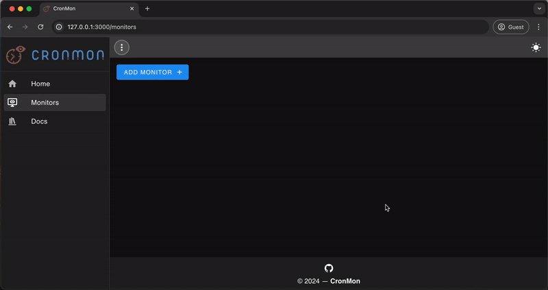

# The frontend application for [_CronMon_](https://github.com/cron-mon-io/cron-mon)

Allows users to create an manage their monitors, and observe the performance of their jobs as
they're monitored.

## Current status

CronMon is currently still under development, but it does support basic usage.

## Getting started

All you need to setup a development environment for the Cron-Mon app is Docker and your IDE of
choice. A `Makefile` is provided to make _driving_ the project quick and simple. The easiest way to
get setup is to simply clone the project and then run `make install` from the root of the project to
build the containers. From here you can run the projects (unit) tests by running `make test`, and
you can run the application via `make run`. When running the Cron-Mon app you'll probably also want
to run [CronMon](https://github.com/cron-mon-io/cron-mon) API, as the app will attempt to use it,
and it doesn't do much without it.

A [Development container](https://containers.dev/) configuration file is also provided to ensure
your IDE can use your local container's environment.

### Makefile

- `install`: Builds all application containers, installs the required Node modules in the Vue
  application and sets up a local PostgreSQL database with test data.
- `build-containers`: Builds all application containers.
- `npm-install`: Installs the required Node modules in the Vue application's container.
- `build-app`: Builds a production build of the Cron-Mon frontend (Vue application).
- `run`: Run the Cron-Mon API and frontend (Vue application).
- `test`: Run all units tests.

## Deployment

CronMon currently isn't deployed anywhere, but this may change in the future.
